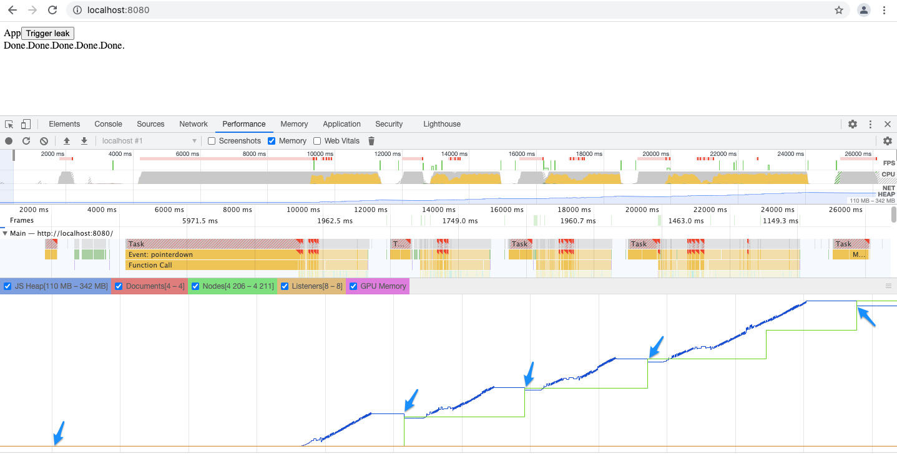
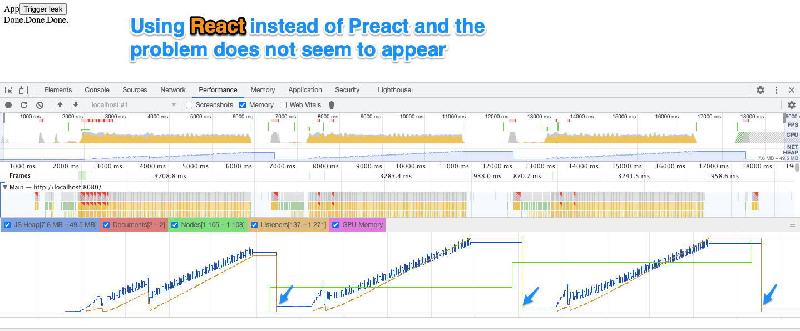

# Possible memory leak in Preact / React-Redux / Redux?

Instructions to recreate:

1. clone repo
2. install node dependencies: `pnpm install`, `yarn install` or `npm install`
3. run `npm start`
4. The application should open in a new tab, if not go to http://localhost:8080/
5. If using Chrome: open the dev tools and go the Chrome performance tab and:
1. hit `record`
2. trigger garbage collect
3. click "Trigger leak"
4. wait for "Done." to appear and then manually trigger another garbage collect
5. repeat a few times then stop recording

Blue arrows indicate when garbage collection was manually triggered

This could not be created when using React [#5176411](https://github.com/AJamesPhillips/possible_preact_redux_mem_leak/commit/5176411)

Or on CodeSandbox

